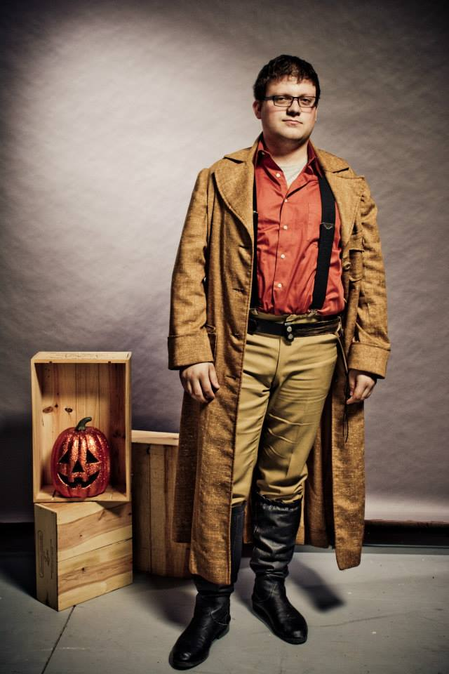

# Staff Team

### Clover - Server Owner

 

Clover (she/they) made a tik tok about wanting more friends to play minecraft with in early 2020 and BOOM suddenly we have a server and discord! For the most part her role in the server is promotion and discord events (and possibly a cult)

### Neigh - Admin

 

'Neigh' (she/her) is our European () admin member who's in charge of Discord management and promotion, as well as the leader of the city-state, Noden. She's a complete history nerd who loves seeing pictures of your pets!

### Daisy - Admin

 

Daisy (she/they) is our wild card admin. She's in charge of in-game events and diversity, as well as the leader of the great forest of Eldershire. The technology stuff is lost on her, but if you need a builder or decorator, she's up for the challenge!

### Zen - Admin

 

Zen (he/him) is our admin for all things technical, from server management to redstone. He's also the founder of the modern city of Arcadia! Fair warning, get me going on issues of social justice and you may never hear the end of it.

### Moderators

Our mods help us keep things running smoothly on both Discord and in-game. They're both skilled builders and upstanding members of our community. Our current mods are **Doubles**, and **Roo**.
